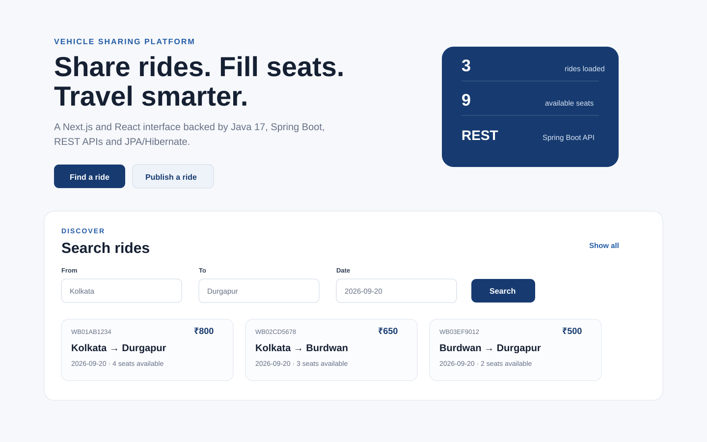

# Vehicle Sharing Platform

A full-stack vehicle and ride sharing platform with a **Next.js + React + TypeScript UI** consuming a **Java 17 + Spring Boot REST backend** with Spring Data JPA/Hibernate and MySQL/H2.

## Next.js UI Preview



The frontend supports ride discovery, route/date search, ride publishing, seat booking and passenger booking lookup through the existing Spring Boot APIs.

## Highlights

- Next.js + React + TypeScript responsive frontend
- RESTful APIs for **vehicles, rides and bookings**
- Layered backend design: **Controller -> Service -> Repository -> Database**
- Persistence with **Spring Data JPA / Hibernate**
- MySQL-ready configuration with **H2** for zero-setup local development
- Bean Validation for request/domain validation
- Transactional booking flow with seat inventory updates
- Route validation that prevents invalid origin/destination ordering
- Centralized API exception handling
- Spring Security configuration foundation
- Maven build and GitHub Actions CI

## Architecture

```text
Next.js / React / TypeScript
          |
          v
Spring Boot REST Controllers
          |
          v
Service Layer
          |
          v
Spring Data JPA Repositories
          |
          v
Hibernate / JPA -> H2 / MySQL
```

## Tech stack

| Area | Technology |
|---|---|
| Frontend | Next.js, React, TypeScript, CSS |
| Backend language | Java 17 |
| Framework | Spring Boot 3 |
| API | Spring Web / REST |
| Persistence | Spring Data JPA, Hibernate |
| Database | MySQL, H2 |
| Validation | Jakarta Bean Validation |
| Security | Spring Security |
| Build | Maven |
| Testing | JUnit 5, Mockito |
| CI | GitHub Actions |

## API endpoints

| Method | Endpoint | Purpose |
|---|---|---|
| GET | `/api/vehicles` | List vehicles |
| POST | `/api/vehicles` | Create a vehicle |
| GET | `/api/rides` | List rides |
| GET | `/api/rides/{id}` | Get ride by id |
| GET | `/api/rides/search?from=...&to=...&date=YYYY-MM-DD` | Search rides |
| POST | `/api/rides` | Publish a ride |
| DELETE | `/api/rides/{id}` | Delete a ride |
| POST | `/api/bookings` | Book seats |
| GET | `/api/bookings?passengerEmail=...` | View passenger bookings |

## Run locally

### Backend

```bash
git clone https://github.com/souravbanerjee23/Vehcile-Sharing-Final.git
cd Vehcile-Sharing-Final
mvn clean test
mvn spring-boot:run
```

The Spring Boot application starts on `http://localhost:8080` and uses H2 by default.

### Frontend

```bash
cd frontend
npm install
npm run dev
```

The Next.js application starts on `http://localhost:3000`. Set `NEXT_PUBLIC_API_BASE_URL` if the backend runs somewhere other than `http://localhost:8080`.

## Key design decisions

### Route-order validation
A booking is accepted only when the selected destination appears after the selected start location in the ride's ordered route.

### Transactional seat update
Booking creation and seat decrement execute within a transaction so the database operations are treated as one unit of work.

### Typed frontend API integration
The Next.js frontend uses TypeScript models and a centralized API client for rides and bookings, keeping UI workflows aligned with the Spring Boot REST contract.

## Project structure

```text
frontend/                         # Next.js + React + TypeScript UI
src/main/java/com/sourav/vehiclesharing
├── config/                       # Spring Security configuration
├── controller/                   # REST controllers
├── exception/                    # Centralized exception handling
├── model/                        # JPA entities
├── repository/                   # Spring Data repositories
└── service/                      # Business logic / booking validation
```

## Resume-ready summary

**Vehicle Sharing Platform | Next.js, React, TypeScript, Java 17, Spring Boot, REST APIs, Spring Data JPA, Hibernate, MySQL**  
Built a responsive Next.js frontend consuming Spring Boot REST APIs for ride discovery, publishing and seat booking, backed by a layered Java service with route/date validation and transactional seat-inventory updates.

---

Created and maintained by [Sourav Bandyopadhyay](https://www.linkedin.com/in/sourav-bandyopadhyay-78497715a/).
